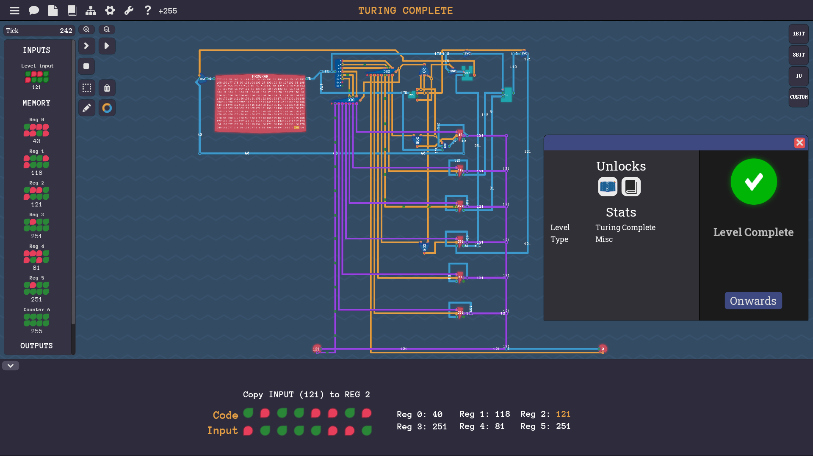
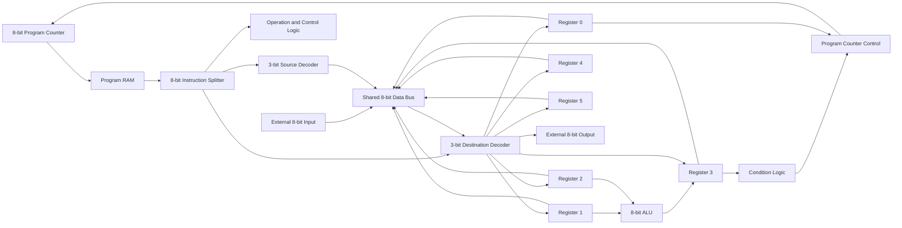

# 8-Bit CPU Built from Logic Gates

> A working 8-bit CPU designed and tested in **Turing Complete**. The processor includes program memory, a program counter, instruction decoding, six registers, an ALU, conditional jumps, external input, and output control.



## Project Summary

This project demonstrates how a small CPU can be built from basic digital-logic components instead of using a ready-made processor.

I built the complete datapath and control logic inside the game **Turing Complete**. While building each module, I also studied how the same logic can be implemented using physical logic gates and transistors. The design can therefore be used as a starting point for a future physical version.

The CPU can:

- Fetch instructions from program RAM.
- Decode an 8-bit instruction.
- Copy data between registers, input, and output.
- Perform arithmetic and logic operations.
- Store intermediate values in six 8-bit registers.
- Read one 8-bit value from an external input.
- Produce an 8-bit external output.
- Change program flow with a conditional jump.

## Why I Built It

The purpose of this project was to understand what happens below normal programming languages.

Instead of treating the CPU as a black box, I built the main parts myself:

- Combinational logic, such as XOR gates, multiplexers, and decoders.
- Sequential logic, such as registers and the program counter.
- A shared 8-bit data path.
- Instruction-selection and destination-selection logic.
- Arithmetic and logic execution.
- Conditional control flow.

This project demonstrates knowledge of digital logic, computer architecture, state, memory, binary instruction formats, control signals, and hardware debugging.

## Architecture Overview



The processor has two main sections:

1. **Datapath** — moves and processes 8-bit values.
2. **Control path** — decodes the instruction and enables the correct components.

## How One Instruction Runs

A CPU cycle follows this general sequence:

1. The program counter provides the address of the current instruction.
2. Program RAM returns the instruction stored at that address.
3. The byte splitter separates the instruction into control fields.
4. The source decoder selects the component that may place a value on the data bus.
5. The destination decoder selects the component that will receive the value.
6. If the instruction requests an ALU operation, Registers 1 and 2 are processed and the result is stored in Register 3.
7. The condition logic checks Register 3 when a conditional jump is requested.
8. The program counter either advances normally or is overwritten with the value in Register 0.

## Main Components

### 1. Program Counter

The program counter is an 8-bit counter that stores the address of the instruction currently being executed.

During normal operation, it advances to the next instruction. For a conditional jump, the counter can be overwritten with the value stored in **Register 0**.

In this design:

- Normal condition: continue to the next instruction.
- Jump condition true: load the counter from Register 0.
- Jump condition false: continue normally.

This creates basic program control such as loops and conditional branches.

### 2. Program RAM

Program RAM stores the machine instructions.

The program counter is connected to the RAM address input. The selected RAM location outputs the instruction that the CPU must execute.

The RAM acts as instruction memory in this design. A program is loaded into RAM before execution begins.

### 3. 8-Bit Instruction Splitter

The splitter separates one 8-bit instruction into smaller control fields.

These fields tell the CPU:

- Which component is the data source.
- Which component is the destination.
- Which operation or control mode must be used.

The exact bit layout should be documented in `docs/instruction-set.md`. A clear bit diagram is important because it allows another person to write programs for the CPU.

### 4. Source Decoder

The first 3-bit decoder selects the source of the data.

A 3-bit value can represent eight choices. Depending on the instruction, the selected source may be a register, the external input, or another internal value.

Only the selected source is allowed to drive the shared data bus. This prevents multiple components from trying to send different values at the same time.

### 5. Destination Decoder

The second 3-bit decoder selects where the data must be stored or sent.

The decoder activates one destination, such as:

- Register 0
- Register 1
- Register 2
- Register 3
- Register 4
- Register 5
- External output
- A reserved or control destination

The selected destination receives the value currently present on the data bus.

### 6. Six 8-Bit Registers

Registers are small, fast storage locations inside the CPU. Each register stores one byte.

#### Register 0 — Jump Target

Register 0 can hold the address used by a conditional jump. When the jump condition is true, its value overwrites the program counter.

It may also be used as normal storage when a jump is not required.

#### Register 1 — ALU Input A

Register 1 provides the first input to the ALU.

#### Register 2 — ALU Input B

Register 2 provides the second input to the ALU.

#### Register 3 — ALU Result and Condition Value

The ALU writes its result to Register 3.

The conditional logic also checks Register 3. This lets a calculation affect program flow. For example, a program can calculate a value and then jump when the result matches the selected condition.

#### Registers 4 and 5 — General-Purpose Storage

Registers 4 and 5 hold temporary values, constants, or intermediate results required by the program.

### 7. External 8-Bit Input

The input component provides one byte from outside the CPU.

An instruction can select this input as the source and copy its value into a register. This is the CPU's connection to external data.

Examples include:

- A value entered by the user.
- A sensor value in a physical implementation.
- Data supplied by another circuit.

### 8. Arithmetic Logic Unit

The ALU performs arithmetic and logical operations.

In this architecture:

- Input A comes from Register 1.
- Input B comes from Register 2.
- The result is written to Register 3.

Depending on the selected operation, an ALU may perform functions such as addition, subtraction, AND, OR, XOR, comparison, shifts, or negation. The exact supported operations should be listed in `docs/instruction-set.md`.

### 9. XOR Logic

XOR outputs true when its inputs are different.

It is useful for:

- Bitwise XOR operations.
- Detecting differences between signals.
- Building adders and arithmetic circuits.
- Inverting a signal under the control of another signal.

In this CPU, XOR is used where conditional inversion or difference detection is required.

### 10. Multiplexer

A multiplexer selects one of several values and passes the selected value to its output.

The program-counter control uses a multiplexer-like decision:

- Select the normal next counter value, or
- Select the jump address from Register 0.

Multiplexers are also useful wherever the same destination can receive data from different sources.

### 11. Input Allower / Bus Enable

“Input allower” is the name used here for a controlled gate that decides whether a component may place its value on the shared bus.

When disabled, the component must not affect the bus. When enabled, its 8-bit value is passed through.

This is similar to a bus-enable or tri-state-output function in hardware design. The source decoder controls these gates so that only one source is active at a time.

### 12. Condition Logic

The condition block examines Register 3 and produces a true or false result.

The result controls whether the program counter continues normally or loads the jump address from Register 0.

Possible conditions include zero, non-zero, positive, negative, equal, or other comparisons, depending on the exact circuit implementation.

### 13. External Output

The output component sends one 8-bit value outside the CPU.

When the destination decoder selects the output, the current data-bus value becomes the processor's visible result.

In a physical version, this output could connect to LEDs, a display, another processor, or an external interface.

## Register Summary

| Register | Main purpose |
|---|---|
| R0 | Conditional-jump target and optional storage |
| R1 | ALU input A |
| R2 | ALU input B |
| R3 | ALU result and condition value |
| R4 | General-purpose storage |
| R5 | General-purpose storage |

## Instruction Format

Document the real instruction encoding here before publishing the repository.

A useful format is:

```text
Bit:       7 6 | 5 4 3 | 2 1 0
Purpose:   mode|source |destination
```

This is only a documentation pattern. Replace it with the exact bit positions used by the circuit.

For every instruction, record:

- Binary value.
- Hexadecimal value.
- Source selection.
- Destination selection.
- ALU or control operation.
- Registers changed.
- Program-counter behavior.
- One example.

See `docs/instruction-set.md` for a table template.

## Example Data Movement

The screenshot shows an instruction that copies the external input value `121` into Register 2.

The control path performs the following actions:

1. Decode the source field as `INPUT`.
2. Enable the external input onto the 8-bit data bus.
3. Decode the destination field as `REGISTER 2`.
4. Enable the save signal for Register 2.
5. Store `121` in Register 2 on the active clock step.

The same path can be reused for other register-to-register and input-to-register copy instructions.

## Conditional Jump Example

A typical conditional sequence is:

1. Place an ALU operand in Register 1.
2. Place another operand in Register 2.
3. Run the required ALU operation.
4. Store the result in Register 3.
5. Place the target instruction address in Register 0.
6. Execute the conditional-jump instruction.
7. If the condition based on Register 3 is true, overwrite the program counter with Register 0.
8. Otherwise, continue with the next instruction.

This mechanism is enough to create loops, decisions, and more complex programs.

## Reproducing the CPU

A practical build order is:

1. Build and test basic one-bit gates.
2. Combine the gates into 8-bit operations.
3. Build one 8-bit register and verify save/hold/output behavior.
4. Duplicate the register to create R0 through R5.
5. Build the 8-bit program counter.
6. Connect the counter to program RAM.
7. Build the instruction splitter.
8. Build both 3-bit decoders.
9. Create the shared 8-bit data bus.
10. Add one bus-enable gate for every possible source.
11. Connect destination-decoder outputs to register save controls.
12. Connect R1 and R2 to the ALU.
13. Connect the ALU result to R3.
14. Add condition logic using R3.
15. Add the counter-selection logic using R0 and the condition output.
16. Connect the external input and output.
17. Load a small test program into RAM.
18. Test each instruction separately before testing a full program.

## Testing Strategy

A hardware project is more convincing when every module has evidence that it works.

Recommended tests:

| Test | Expected result |
|---|---|
| Register save | New value is stored only when save is enabled |
| Register hold | Old value remains when save is disabled |
| Source decoder | Exactly one source is enabled for each selector value |
| Destination decoder | Exactly one destination save signal is enabled |
| ALU operation | Output matches a manually calculated result |
| Program counter | Counter advances during normal execution |
| Jump false | Counter continues to the next instruction |
| Jump true | Counter loads the address stored in R0 |
| Input copy | External input is stored in the selected register |
| Output copy | Selected bus value appears at external output |
| Full program | Program reaches the expected final register and output values |

Add screenshots, short videos, or test tables for these cases.

## Physical Transistor Implementation

The logical design can be recreated physically, but the best approach is to build it in stages.

Suggested progression:

1. Build a transistor-level NOT gate.
2. Build NAND and NOR gates.
3. Derive AND, OR, and XOR from the basic gates.
4. Build a one-bit latch or flip-flop.
5. Build a one-bit full adder.
6. Build a one-bit ALU slice.
7. Connect eight slices to create an 8-bit unit.
8. Build an 8-bit register.
9. Build the decoder and bus-control circuits.
10. Combine the tested modules into the complete CPU.

For the physical version, add:

- Circuit schematics.
- Transistor or logic-IC part numbers.
- Bill of materials.
- Supply voltage.
- Clock source and clock frequency.
- Photos of the breadboard or PCB.
- Measurements from a multimeter, oscilloscope, or logic analyzer.
- A video showing a program running.


## Repository Structure

```text
building-cpu-from-scratch/
├── README.md
├── assets/
│   └── cpu-overview.png
├── docs/
│   ├── architecture.md
│   ├── components.md
│   ├── instruction-set.md
│   ├── build-guide.md
│   └── testing.md
├── programs/
│   └── README.md
└── hardware/
    └── README.md
```

## Skills Demonstrated

- Boolean algebra and digital logic.
- Combinational-circuit design.
- Sequential logic and state storage.
- Register-transfer-level thinking.
- CPU datapath design.
- Instruction decoding.
- Program-counter and branch logic.
- ALU design.
- RAM addressing.
- Shared-bus control.
- Modular testing and debugging.
- Technical documentation.
- Understanding of transistor-level implementation.

## Evidence of Completion

The image at the top shows the CPU completing the **Turing Complete** level successfully.

For a stronger engineering portfolio, this repository should also include:

- A short screen recording of the CPU executing a program.
- A labeled version of the architecture screenshot.
- Close-up screenshots of each component.
- The complete instruction table.
- At least three example programs.
- Test results showing expected and actual values.
- A physical prototype of at least one module.

## Limitations

This is an educational 8-bit CPU, not a modern commercial processor.

Current limitations may include:

- Small register count.
- Limited instruction width.
- Limited program-memory size.
- Simple branch conditions.
- No interrupt system.
- No cache.
- No pipeline.
- No operating system.

These limitations are intentional because the project focuses on understanding the core principles of CPU operation.

This project was built using the educational game **Turing Complete**. The game was used as a design and simulation environment; the CPU architecture, wiring, documentation, and implementation decisions shown in this repository are my project work.
